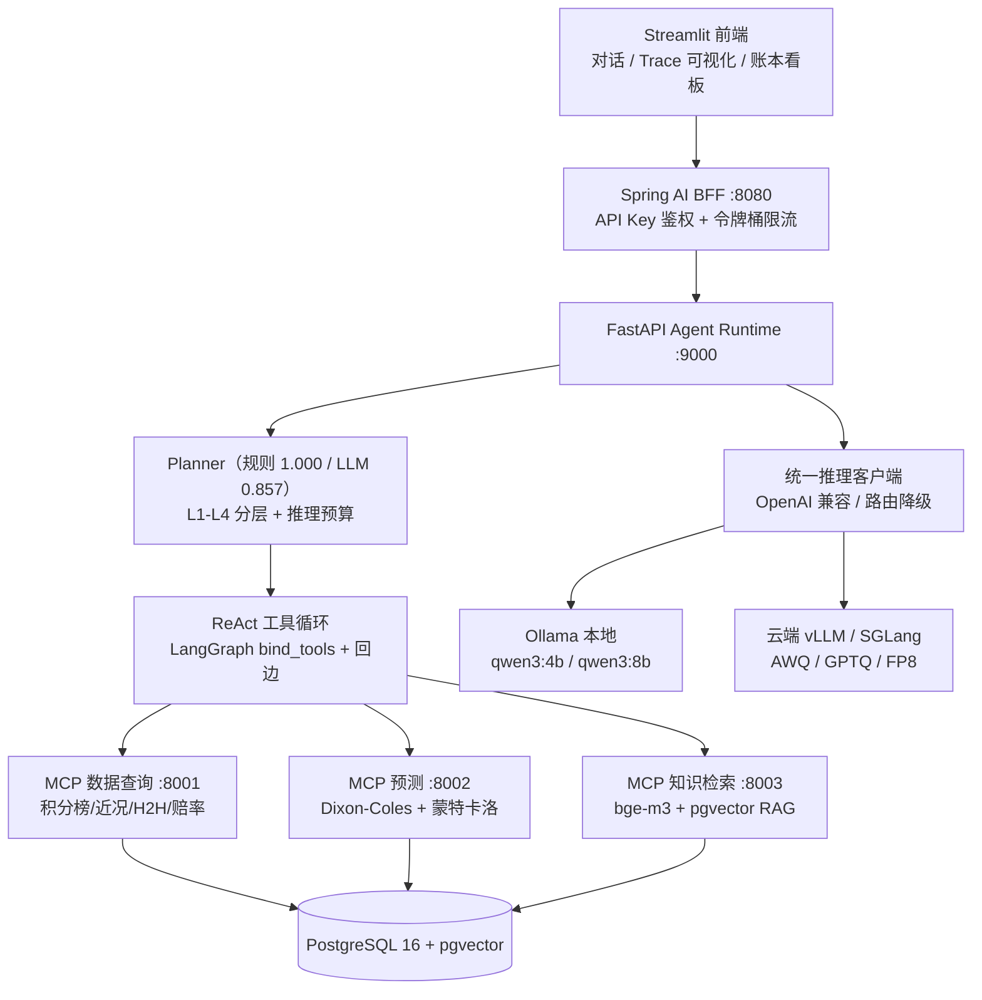

# 推理感知型体育预测 Agent (sports-agent)

根据任务复杂度动态分配推理预算的足球赛事预测 Agent：L1/L2 走 Qwen3-4B 轻量量化模型，L3/L4 走 Qwen3-8B 强模型 + ReAct 多工具循环。预测由可回测的统计/ML 模型给出（ELO / Dixon-Coles / XGBoost），LLM 负责信息聚合与解释；知识层用 bge-m3 + pgvector 做带溯源的 RAG；工具能力通过 MCP 协议同时服务于 Python Agent 与 Java 企业服务。

完整设计见 [推理感知型体育预测Agent方案_v2.md](./推理感知型体育预测Agent方案_v2.md)。

## 架构一览



## 环境要求

- Python 3.11+
- Docker（仅用于 postgres+pgvector）
- [Ollama](https://ollama.com)（macOS 原生，Metal 加速）
- JDK 21、Maven 3.9（仅 spring-service）

## 快速开始

```bash
# 1) Python 虚拟环境与依赖（按阶段装 extras；全量可一次性装 ml,mcp,ui）
python3.11 -m venv .venv && source .venv/bin/activate
pip install -e ".[dev]"                       # 骨架阶段核心依赖
# pip install -e ".[ml,mcp,ui,dev]"          # W3 起

# 2) PostgreSQL + pgvector
cp .env.example .env
docker compose up -d                          # 等到 healthy：docker compose ps

# 3) Ollama 模型（W4 前需要；bge-m3 在 W5 RAG 时拉）
ollama pull qwen3:4b
ollama pull qwen3:8b
# ollama pull bge-m3

# 4) W1：下载历史数据（football-data.co.uk，含 closing odds）
python data/scripts/fetch_csv.py --leagues E0 SP1 D1 I1 F1 --seasons 2324 2425

# 5) Agent API（:9000）
uvicorn sports_agent.api.main:app --reload --port 9000
curl -s http://localhost:9000/health
curl -s -X POST http://localhost:9000/analyze -H 'Content-Type: application/json' \
  -d '{"query":"英超积分榜","dry_run":true}'   # 只看 Planner 分层，不调用 LLM

# 6) 冒烟测试
pytest -q
```

### MCP Servers（W6）

```bash
pip install -e ".[mcp]"
fastmcp run mcp_servers/data_server.py       --transport http --port 8001
fastmcp run mcp_servers/prediction_server.py --transport http --port 8002
fastmcp run mcp_servers/knowledge_server.py  --transport http --port 8003
```

### W6 验证（data 工具 / Planner / ReAct）

```bash
# 1) 路由评测集 + 规则版/LLM 版分类准确率 + L1-L4 端到端 ReAct
python data/scripts/build_routing_eval.py            # 生成 100 条 routing.jsonl
python -m sports_agent.eval.experiment_w6             # 产物：benchmarks/results/w6/

# 2) data_server 四个 SQL 工具直调（不启动 MCP 进程，直查 PostgreSQL）
python -c "from sports_agent.data.queries import query_standings; print(query_standings('E0','2425')[:3])"

# 3) 单元测试（不依赖 Ollama；DB 不可用时设 SKIP_DB_TESTS=1 跳过 data 工具用例）
pytest tests/test_agent_w6.py -q
```

### Spring AI BFF（W8）

Spring Boot 3.4 + Spring AI 1.0 + JDK 21，最小版企业服务层。

```bash
cd spring-service && mvn spring-boot:run
# 健康检查（公开）：curl http://localhost:8080/api/health
# 工具列表（需 API Key）：curl -H 'X-API-Key: demo-key-001' http://localhost:8080/api/tools
# 预测账本：curl -H 'X-API-Key: demo-key-001' 'http://localhost:8080/api/predictions?summary=true'
# 分析透传：curl -X POST -H 'X-API-Key: demo-key-001' -H 'Content-Type: application/json' \
#   -d '{"query":"英超积分榜"}' http://localhost:8080/api/analyze
# Actuator：curl http://localhost:8080/actuator/health
```

| 模块 | 实现 |
|---|---|
| 对外 API | `/api/analyze`（透传 FastAPI）、`/api/predict`、`/api/predictions`（pred_ledger）、`/api/tools`（MCP） |
| 鉴权 | API Key（`X-API-Key` 头），Stateless |
| 限流 | Bucket4j 令牌桶，20 req/min/IP |
| MCP Client | `spring-ai-starter-mcp-client` Streamable HTTP 连三个 Python Server |
| 可观测 | Actuator（health/metrics），HikariPool 连 PostgreSQL |

## 数据纪律（README 数字规则）

README 与简历中所有性能/质量数字必须来自 `benchmarks/results/` 中的实验产物（原始 CSV/JSON + 生成图表的脚本），禁止手填目标值；没有数据的位置写"未测"。引用论文数字须标注来源。

## 实测结果汇总（全部引自 benchmarks/results/ 原始产物）

| 实验 | 指标 | 实测值 | 产物 |
|---|---|---|---|
| W2 赔率去水 baseline（Pinnacle） | LogLoss，walk-forward 11,601 场五大联赛 | **0.9712**（RPS 0.1958，准确率 53.6%） | [w2/model_comparison.csv](benchmarks/results/w2/model_comparison.csv) |
| W2 Dixon-Coles | LogLoss，同上 | 1.0019 | 同上 |
| W2 ELO | LogLoss，同上 | 1.0755 | 同上 |
| W3 XGBoost + 温度校准 | LogLoss，同上 | **0.9884**（未超赔率 baseline） | [w3/model_comparison.csv](benchmarks/results/w3/model_comparison.csv) |
| W3 flat-stake 投注回测 | ROI（edge≥0.02，10,795 注） | **-1.9%**（与市场有效假说一致，正 ROI 仅存在于个别联赛×赛季切片，如 E0/1920 +10.6%） | [w3/backtest_summary.csv](benchmarks/results/w3/backtest_summary.csv) |
| W4 DC 解析解 vs 蒙特卡洛 | 主胜概率（50,000 次采样） | 0.3355 vs 0.3366（一致性校验） | [w4/single_match_demo.json](benchmarks/results/w4/single_match_demo.json) |
| W5 RAG 问答 | 准确率（n=20） | **RAG 0.65 vs 无 RAG 0.05** | [w5/qa_summary.csv](benchmarks/results/w5/qa_summary.csv) |
| W5 检索质量 | recall@5（n=80） | 0.0125 ⚠️ Ollama bge-m3 常量向量 bug（详见下注） | [w5/retrieval_metrics.csv](benchmarks/results/w5/retrieval_metrics.csv) |
| W6 规则路由 | Accuracy（100 条评测集） | **1.000**（macro-F1 1.000，延迟 <1ms） | [w6/routing_metrics.csv](benchmarks/results/w6/routing_metrics.csv) |
| W6 LLM 路由 | Accuracy（28 条抽样） | 0.857（平均延迟 51.1s，qwen3:4b 本地） | 同上 |
| W7 云 GPU（vLLM/SGLang 量化与服务化） | 延迟 / 吞吐 / 显存 | **未测**——脚本已就绪（[deploy/cloud/](deploy/cloud/)），待租机执行 | 预计 `benchmarks/results/w7/` |
| W8 Spring AI BFF | 烟测 | 5/5 通过（health/鉴权/限流/透传/账本） | 本 README W8 节 |
| 全仓测试 | pytest | 79 passed | `tests/` |

> ⚠️ W5 说明：检索召回率异常低的根因是 Ollama 0.34.2 的 bge-m3 返回常量向量（RAG 问答仍靠关键词兜底命中 0.65），修复追踪见方案文档 §5.4；该数字如实保留作为已知缺陷记录。

## 复现命令

```bash
# W1 数据管道（当前库含 20,013 场，覆盖 1516–2627 赛季至 2026-09-20）
python data/scripts/fetch_csv.py --leagues E0 SP1 D1 I1 F1 \
  --seasons 1516 1617 1718 1819 1920 2021 2122 2223 2324 2425 2526 2627
python data/scripts/normalize.py && python data/scripts/load_pg.py

# W2/W3 模型对比与投注回测
python -m sports_agent.eval.experiment     # → benchmarks/results/w2/
python -m sports_agent.eval.experiment_w3  # → benchmarks/results/w3/

# W4 蒙特卡洛（单场 demo + 赛季模拟）
python -m sports_agent.eval.experiment_w4   # → benchmarks/results/w4/

# W5 RAG 评测（需 pgvector 容器与 bge-m3）
python -m sports_agent.eval.experiment_w5   # → benchmarks/results/w5/

# W6 路由评测 + ReAct 端到端
python data/scripts/build_routing_eval.py
python -m sports_agent.eval.experiment_w6   # → benchmarks/results/w6/

# W7 云 GPU 实测（AutoDL RTX 4090，约 ¥5–12/2–4h）
bash deploy/cloud/run_all.sh                # E2 量化对比 + E3 并发网格 + E4 SGLang 对照
python -m sports_agent.eval.experiment_w7 summarize   # 云端产物解析汇总（本机执行）

# 全部测试
pytest -q                                   # 无 DB 环境：SKIP_DB_TESTS=1 pytest -q
```

## 演示视频脚本（3 分钟，L1→L4）

| 时间 | 画面 | 讲解要点 |
|---|---|---|
| 0:00–0:20 | README 架构图 | 一句话定位：按复杂度分配推理预算的足球预测 Agent；预测由可回测统计模型给出，LLM 只做聚合与解释 |
| 0:20–0:50 | Streamlit 问"英超积分榜" | 右栏 trace：规则 Planner 秒级路由 L1 → 调 query_standings → 引用最新赛季数据；强调 0 大模型调用 |
| 0:50–1:30 | 问"曼联对利物浦谁会赢" | L2：强制先调 predict_match；trace 可见 Dixon-Coles 解析概率 + 蒙特卡洛 5 万次采样置信区间；概率来自可回测模型而非 LLM 编造 |
| 1:30–2:10 | 问"详细分析双红会" | L3：search_knowledge 带文档溯源； trace 展示多轮工具循环与 token 消耗 |
| 2:10–2:40 | 问"模拟本赛季英超前四概率" | L4：simulate_season 双循环推断剩余赛程做蒙特卡洛，输出夺冠/前四/降级概率分布 |
| 2:40–3:00 | 底栏账本看板 + W2/W3 结果表 | pred_ledger 记录每条预测并回填结算（LogLoss/Brier/RPS）；投注回测诚实呈现负 ROI；一图收尾"每个数字都有产物" |

## 十周路线图（12–15h/周）

- [x] W1 数据管道 + EDA（19,763 场已入库，详见 `data/processed/eda_report.txt`）
- [x] W2 walk-forward 脚手架 + 赔率去水 baseline（LogLoss/Brier/RPS，详见 `benchmarks/results/w2/`）
- [x] W3 XGBoost 主模型 + 温度/isotonic 校准 + flat-stake 投注回测（详见 `benchmarks/results/w3/`）
- [x] W4 蒙特卡洛 + 本地推理双档 + FastAPI（详见 `benchmarks/results/w4/`）
- [x] W5 bge-m3 + pgvector RAG（详见 `benchmarks/results/w5/`）（recall@5 / 溯源）
- [x] W6 三个 MCP Server + Planner + ReAct 端到端（详见 `benchmarks/results/w6/`）（规则版路由准确率、混淆矩阵、L1-L4 端到端 trace）
- [ ] W7 云 GPU 实测 vLLM AWQ/GPTQ/FP8 + SGLang RadixAttention（预算 ¥50）
- [x] W8 Spring AI BFF（鉴权 + 限流 + MCP client + 可观测，5 项烟测通过）
- [x] W9 Streamlit trace 可视化 + pred_ledger 回填与看板
- [x] W10 README 实测表/架构图/复现命令/演示脚本收口 + GitHub Actions CI（W7 数字待云机实测后回填）

## 目录结构

```
config/models.yaml        推理后端注册表与层级预算
                          （Qwen3 默认思考模式，需 max_tokens≥2048 让其思考完后输出答案/tool_calls）
db/init/                  PostgreSQL 初始化 SQL
data/{raw,processed,master,scripts}   数据域
src/sports_agent/
  inference/  OpenAI 兼容客户端（Qwen3 关闭思考）
  agent/      state / planner / graph
  data/ ml/ eval/ rag/ api/
mcp_servers/  data / prediction / knowledge 三个 MCP Server
benchmarks/   评测集、实验脚本、results 原始数据
spring-service/  Spring AI 最小 BFF
frontend/     Streamlit
```
